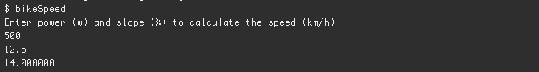

# bicycleSpeedBySlope.

This program is an attempt to implement in C the formulas from <http://www.kreuzotter.de/english/espeed.htm>. For now, it calculates the estimated speed for a given slope.




Noneless, you can tweak all parameters inside bikeSpeedConstant.h, to get a better approxiation of the bicycle speed :

- Wind (m/s)
- Elevation above the sea (m)
- Temperature (°C)
- Mass of the rider (kg)
- Mass of the bike (kg)
- Effective drag area (m^2)
- Coeff of rolling resistance.
- Coefficient for velocity-dependent dynamic rolling resistance
- Coefficient for power transmission losses and losses due to tire slippage
- Air density at sea level (kg/m3)
- Air pressure at sea level (Pa)
- Acceleration of gravity (m/s2) ! important if you plan to ride on another planet
- (...)

# Installation of the command line test version
Check if you have `gsl` installed.
Check if the makefile contains the right path information for your plateform. 

```{sh}
cd src
make
make clean
bikeSpeed
```

# Note
This tool was not deeply tested and should not considered as accurate. It's one of my first C function/program. Don't hesitate to give me some advice or comment on this.

